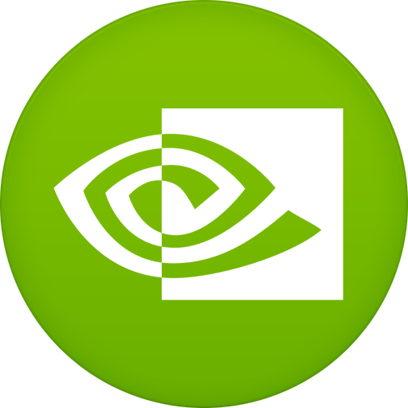

<!--
**rashidrao-pk/rashidrao-pk** is a ✨ _special_ ✨ repository because its `README.md` (this file) appears on your GitHub profile.

- 🔭 I’m currently working on ...
- 🌱 I’m currently learning ...
- 👯 I’m looking to collaborate on ...
- 🤔 I’m looking for help with ...
- 💬 Ask me about ...
- 📫 How to reach me: ...
- 😄 Pronouns: ...
- ⚡ Fun fact: ...
-->

# Few Lines about Muhammad Rashid
 

Hi 👋, I am Muhammad Rashid, an early career **researcher** working in **Artificial Intelligence**, **Computer Vision** and **eXplainable AI**.
- **Present**: I have joined [**_Valeria-Lab_**](https://valeria.ugr.es), [_Dept. of Computer Engineering, Automation and Robotics Department_](https://icar.ugr.es), [_University of Granada_](https://www.ugr.es), Spain as a **_visiting researcher_**, to work on the generation of synthetic data for a use case of EU project [***`DistriMuSe`***](https://distrimuse.eu/about-the-project/).
- **Present**:  I am working on European industrial projects [***`DistriMuSe`***](https://distrimuse.eu/about-the-project/) and [***`NextPerception`***](https://www.nextperception.eu/about-project/) where my role is to improve, develop and utilize the e***X***plainable ***AI*** (***`XAI`***) algorithms to add transparency and trust in the complex AI Models. 
- **Previous**: My past experiences spans building various Computer Vision & Machine Learning Solutions which can be checked by [***`visiting project_completed/README.md`***](project_completed/README.md). 👨🏻‍💻

# 1. Research Projects 🤖🧠👾
Completed projects related  to ***Computer Vision*** and ***Machine Learning*** are described in [***this link***](project_completed/README.md).

# Educational Achievements Summary 🎓

|  Sr. No. | Degree 📘  | Institute                                             | From |  To  |
|  :---:   | :--------   | :------                                              | :--:  | :--: |
| a.       | **Ph. D.(CS)**  | *_University of Turin_*, Italy.                          | 2022  | 2025 |
| b.       | **MS(CS)**      | *_Comsats University Islamabad_*, Wah Campus, Pakistan.  | 2017  | 2019 |
| c.       | **BS(CS)**      | *_Allama Iqbal Open University_* Islamabad, Pakistan.    | 2010  | 2016 |

 

## Educational Achievements 💻
### a. PhD(CS): 
**Details about PhD work**: 
- ***Title, & Type***: Industrial PhD funded by PNRR-CINECA Italy for European Projects
- ***University & Industry***: [***University of Turin***](https://www.unito.it/), [***Rulex Innovation Labs***, *_Italy_*](https://www.rulex.ai/)
- ***Duration***: Oct 2022 - ~ Dec 2025 
- ***Objectives***: Automatic extraction of high-level semantic features, Object Localization, Anomaly Detection and Visual explanations for Anomalies.
- ***Training Activities & Courses***: Check [**Courses Details Here**](courses.md#a-courses-taken-in-phd-degree) and other [***Training Activities Here***](courses.md#seminar--workshops).
- ***Keywords***: eXplainable AI, XAI, Computer Vision, Trustworthy AI, Trustworthy ML
- ***Image Datasets Used***: ImageNet, ImageNet-S, MVTec, MS-COCO.

**Proudly Supervised by**
 - *_Academic_*: [*_Elvio Gilberto Amparore_*](https://informatica.unito.it/do/docenti.pl/Alias?elviogilberto.amparore) , [***Dept. of Computer Science, University of Turin***](http://www.di.unito.it/do/home.pl), Italy. </li>
 - *_Industrial_*: [*_Enrico Ferrari_*](https://www.rulex.ai/about-us), HEAD OF R&D PROJECTS, [***Rulex Innovation Labs***, *_Italy_*](https://www.rulex.ai/).
 - *_Industrial_*: [*_Damiano Verda_*](https://www.rulex.ai/about-us), HEAD OF DATA SCIENCE, [***Rulex Innovation Labs***, *_Italy_*](https://www.rulex.ai/).

***Contributions to European Project***:
  - ***DistriMuSe Website***: My task here is to implement ***Anomaly Detection(AD)*** in robotics use case for human safety, read more details here at [***DistriMuSe Website***](https://distrimuse.eu/about-the-project/).

 **Achievements:**

Acheivements in this study are the following Publications made and also available at [***UniTo portal***](https://iris.unito.it/cris/rp/rp203241).
|  Sr. No. | Title | Journal / Conference | Dates | Location | Publication Date | LINKS  |
| :------: | ----- | ------- | :---: | :--------: | :--------: | :---------: |
| 1. | Anonumous Submission. |  [***A+*** Ranked Conference]() | - | -  | `Under Review` | [Codes]() |
| 2. | ***Can I trust my anomaly detection system? A case study.*** |  [***XAI-World*** ( World Conference on eXplainable Artificial Intelligence)](https://xaiworldconference.com/2024/) | 17-19 July 2024 | Valletta, Malta  | 10 July 2024 | [**Paper PDF Link**](https://link.springer.com/chapter/10.1007/978-3-031-63803-9_13) -:- [**Codes**](https://github.com/rashidrao-pk/anomaly_detection_trust_case_study) -:- [***Medium Blog***](https://muhammad-rashid.medium.com/explainable-anomaly-detection-in-images-using-self-supervised-learning-with-generative-ai-vae-gan-40a34af50dd4)|
| 3. | ***Using Stratified Sampling to Improve LIME Image Explanations.*** | [***AAAI-24*** (38th Annual AAAI Conference on Artificial Intelligence)](https://aaai.org/aaai-conference) |  22-27 feb 2024 | Vancouver, Canada. | 24-03-2024 |  [***Paper PDF Link***](https://ojs.aaai.org/index.php/AAAI/article/view/29397) -:- [***Stratified LIME***](https://github.com/rashidrao-pk/lime_stratified)  -:- [***Examples***](https://github.com/rashidrao-pk/lime-stratified-examples) -:- [***Medium Blog***](https://muhammad-rashid.medium.com/stratified-lime-to-generate-image-explanation-an-improved-version-of-lime-image-6b9668f03f1f)|

### b. Master Degree 

**Degree Details**: 
- ***Title & Duration***: Master of Science (Computer Vision and Graphics), 2017-2019
- ***Courses Taken***: [`Here`](courses.md#b-courses-taken-in-master-degree) is the summary of Courses and other Training Activities.   
- ***Dataset Used***: Caltech-101, Caltech-256, PascalVOC-3D, Flower, Butterfly
- ***Keywords***: Object Detection, Object Localization, Computer Vision, Deep Learning, Feature Engineering, Feature Selection and Optimization.

**Achievements:**

|  Sr. No. | Type    | Title  | Journal  | Publication Date | Paper      |    DOI     |    Codes     |
| :------: | :-----: | :----- | :------- |      :---:       | :--------: | :--------: | :---------: |
| 1. | Research Thesis | Object Detection and Classification based on Feature Fusion and Deep Convolutional Networks.  | --- | --- | --- | --- | [GitHub Repo](https://github.com/rashidrao-pk/Object-detection-and-classification-based-on-feature-fusion-and-deep-convolutional-networks) |
| 2. | Published Research Article | A sustainable deep learning framework for object recognition using multi-layers deep features fusion and selection.  | Sustainability | 19 June 2020 | [Link](https://www.mdpi.com/2071-1050/12/12/5037) | [PDF Link](https://doi.org/10.3390/su12125037) | [GitHub Repo](https://github.com/rashidrao-pk/A-sustainable-deep-learning-framework-for-object-recognition-using-multi-layers-deep-features-fusion), [Mathworks](https://ch.mathworks.com/matlabcentral/fileexchange/70979-object_detection_-_classification?s_tid=prof_contriblnk)|
| 3. | Published Research Article | Object Detection and Classification: A Joint Selection and Fusion Strategy of Deep Convolutional Neural Network and SIFT Point Features. |  Multimedia Tools and Applications | 08 Dec 2018 | [PDF Link](https://link.springer.com/article/10.1007/s11042-018-7031-0) | [LINK](https://doi.org/10.1007/s11042-018-7031-0) | [GitHub Repo ](https://github.com/rashidrao-pk/Object-Detection-and-Classification-A-Joint-Selection-and-Fusion-Strategy-of-Deep-Convolutional-Neu), [Mathworks](https://ch.mathworks.com/matlabcentral/fileexchange/70981-object-detection-classification?s_tid=prof_contriblnk)|

***NOTE:*** Few of the research activities/publications were outcome of collaboration work with other members of the research group. [See](README.md#all-research-articles--publications) 
 

### c. Bachelor Degree

 Bachelor of Science (Computer Science - **_Web Development_**) 

**Degree Details**: 
- ***Title***: Bachelor of Science (Computer Science - Web Development) (2016)
- ***Keywords***: Software Engineering, Web development, Web Applications, Web Security, Information Security. 
<!-- 
 

 Click Here to check full project details  to see details
 -->

**Achievements**: 

|  Sr. No. | Title |
|  :---    | :---  |
|  Product      |  Developed A secure Web Application using MVC architecture and CodeIgnitor Framework  |
|  Name      |  ***OVBTP***, A Secure AI based Web Application for Venue Booking and Tour Planning  |
| Website      | [http://www.ovbtp.com](http://www.ovbtp.com) |
| CODES      | [GITHUB](https://github.com/rashidrao-pk/Online-Venure-Booking-and-Tour-Planning) -   - 
|  Tools Used      |  MVC, MS-SQL, CodeIgnitor, PhP, Javascript, HTML, CSS  |
<!-- 
 -->

 

##  Awards/Honors 🏆:

| Sr. No.| Award Type    | Awarded By        |   Dated   | Reason | Link |
| :---:  | ------------------  | ------------     |   :---:   | :---:   |   :---:    |     
| 1.  | Erasmus Traineeship  | [Erasmus+](https://erasmus-plus.ec.europa.eu) |   Dec, 2024   |   **Erasmus Scholarship** for **Research Activities** in **Spain**    | **_LINK_** |
| 2.  | Italian Industrial Scholarship for PhD Position  | National Recovery and Resilience Plan([NRRP](https://www.italiadomani.gov.it/content/sogei-ng/it/it/home.html)) & Ministry of Universities and Research [MUR](https://www.cineca.it/it) |   Nov, 2022   |   **Fully Funded Scholarship** for **PhD**    | **_LINK_** |
| 3.  | National Laptop  | [Prime Minister Laptop Award]() |   Jan, 2019   |   National **Laptop Winner** in **Prime Minister Laptop Scheme**    | **_LINK_** |

  <a href="#" 
     style="
        display: inline-block; 
        padding: 5px 10px; 
        background-color: #469B60; 
        color: white; 
        text-decoration: none; 
        border-radius: 5px; 
        font-weight: bold; 
        font-size: 14px; 
        box-shadow: 2px 2px 5px rgba(0, 0, 0, 0.2);">
    Go to TOP
  </a>

  

  

---
# All Research Articles / Publications 📊📝:

|  Sr. No. | Title | Role | Journal /  Conferencce | Dated | Paper  | Codes   |
| :------: | ----- | ------- | --- | :---: | :--------: | :---------: |
| 1. | Can I trust my anomaly detection system? A case study. | Main Author | **XAI**-World | 10 July 2024 | [PDF Link](https://link.springer.com/chapter/10.1007/978-3-031-63803-9_13) | [Anomaly detection system](https://github.com/rashidrao-pk/anomaly_detection_trust_case_study) -  - |
| 2. | Using Stratified Sampling to Improve LIME Image Explanations. |Main Author | **AAAI**-24   | 24-03-2024 | [PDF Link](https://ojs.aaai.org/index.php/AAAI/article/view/29397) |  [Stratified LIME](https://github.com/rashidrao-pk/lime_stratified)  [Examples](https://github.com/rashidrao-pk/lime-stratified-examples) -  - |
| 3. | A Novel Light U-Net Model for Left Ventricle Segmentation Using MRI. | Contributor | Mathematics | 24 July 2023 | [PDF Link](https://www.mdpi.com/2227-7390/11/14/3245) |  [GitHub Repo](https://github.com/rashidrao-pk/A-Novel-Light-Unet-Model-for-Left-Ventricle-Segmentation-Using-MRI) |
| 4. | A sustainable deep learning framework for object recognition using multi-layers deep features fusion and selection | Main Author | Sustainability | 19 June 2020 | [PDF Link](https://www.mdpi.com/2071-1050/12/12/5037) | [GitHub Repo ](https://github.com/rashidrao-pk/A-sustainable-deep-learning-framework-for-object-recognition-using-multi-layers-deep-features-fusion) -   -   |
| 5. | An Optimized Approach for Breast Cancer Classification for Histopathological Images Based on Hybrid Feature Set. | Contributor | Current medical imaging | 22 Apr 2020 |[PDF Link](https://www.ingentaconnect.com/content/ben/cmir/2021/00000017/00000001/art00016)  | [GitHub Repo](https://github.com/rashidrao-pk/An-Optimized-Approach-for-Breast-Cancer-Classification-for-Histopathological-Images-Based-on-Hybrid-) |
| 6. | Deep CNN and geometric features-based gastrointestinal tract diseases detection and classification from wireless capsule endoscopy images. | Contributor | Journal of Experimental & Theoretical Artificial Intelligence | 02 Feb 2019 | [PDF Link](https://www.tandfonline.com/doi/abs/10.1080/0952813X.2019.1572657) | [GitHub Repo](https://github.com/rashidrao-pk/Deep-CNN-and-geometric-features-based-gastrointestinal-tract-diseases-detection-and-classification-f) -  -  |
| 7. | Classification of Gastrointestinal Diseases of Stomach from WCE using the improved Saliency-based method and Color Features. | Contributor | Multimedia Tools and Applications | 06 Jun 2019 | [PDF Link](https://link.springer.com/article/10.1007/s11042-019-07875-9) | [GitHub Repo](https://github.com/rashidrao-pk/Classification-of-Gastrointestinal-Diseases-of-Stomach-from-WCE-using-the-improved-Saliency-based-me) :-: [Mathworks](https://ch.mathworks.com/matlabcentral/fileexchange/113080-classification-of-gastrointestinal-diseases-of-stomach?s_tid=prof_contriblnk) |
| 8. | An integrated framework of skin lesion detection and recognition through saliency method and optimal deep neural network features selection. | Contributor | Neural Computing and Applications | 08 Nov 2019 | [PDF Link](https://link.springer.com/article/10.1007/s00521-019-04514-0) | [GitHub Repo](https://github.com/rashidrao-pk/An-integrated-framework-of-skin-lesion-detection-and-recognition-through-saliency-method-and-optimal) |
| 9. | Object Detection and Classification: A Joint Selection and Fusion Strategy of Deep Convolutional Neural Network and SIFT Point Features. | Main Author | Multimedia Tools and Applications | 08 Dec 2018 | [PDF Link](https://link.springer.com/article/10.1007/s11042-018-7031-0) | [GitHub Repo](https://github.com/rashidrao-pk/A-sustainable-deep-learning-framework-for-object-recognition-using-multi-layers-deep-features-fusion) -  -  |
| 10. | Region-based active contour JSEG fusion technique for skin lesion segmentation from dermoscopic images | Contributor | Biomedical Research | 19 Sep 2019 | [PDF Link](https://1stdirectory.co.uk/_assets/files_comp/ad6f229c-84db-4857-a481-2f6e9377461d.pdf) | - |

  <a href="#" 
     style="
        display: inline-block; 
        padding: 5px 10px; 
        background-color: #469B60; 
        color: white; 
        text-decoration: none; 
        border-radius: 5px; 
        font-weight: bold; 
        font-size: 14px; 
        box-shadow: 2px 2px 5px rgba(0, 0, 0, 0.2);">
    Go to TOP
  </a>

---   
   
# Certificates 📝:

##  a. Certificates of Conferences:

| Sr. No. | Conference          | Role     |   Location   |  From-To  |  Presentation/Paper/Certificate Links |
| :-----: | ------------------  |:---:     |   :---:      |  :---:    |                :---:                  |
| 1.      | `XAI-World` (World Conference on eXplainable Artificial Intelligence) |   `Oral Presenter in Main Track` & Attendee  |  Valletta,Malta     | 17-19 July 2024   | [`Presentation Link`](https://xaiworldconference.com/2024/timetable/event/s-17-a-1/), [Attendance Certificate](files/certificates/xai_2024.png)   |
| 2. | `AAAI-24` (Association for the Advancement of Artificial Intelligence (AAAI)) | `Oral Presenter in Main Track` & Attendee  |  Vancouver, Canada  | 22-27 Feb 2024   |     [`Presentation Link`](https://underline.io/speakers/254136-muhammad-rashid), [Attendance Certificate](files/certificates/AAAI-24_Certificate.jpeg)   |
| 3. | `ECML-PKDD-23` (European Conference on Machine Learning-PKDD) |    Attendee                 | Turin,Italy     | 18-22, Sep 2023    | [Attendance Certificate](files/certificates/ECML_23.png) |
| 4. | `icSoftComputing` (International Conferecne on Soft Computing and its Engineering Applications) |    Attendee                 | Remote     | 10-12, Dec 2024    | [Attendance Certificate](files/certificates/icSoftComp2024.jpg) |
---

##  b. Certificates of Courses:
| Sr. No. | Certificate Name                           | Issued By            |   Dated         | Course Length | Certificate |
| :---: | ------------------                           | ------------         |   :---:         |   :---:   |     :---:   |
| 1.    | [Build Basic Generative Adversarial Networks (GANs)](https://www.coursera.org/learn/build-basic-generative-adversarial-networks-gans/) | [DeepLearning.AI](https://www.deeplearning.ai/) |  04-02-2025    | 29 hours   |  [LINK](https://www.coursera.org/account/accomplishments/verify/OVXPELXP2RAP?utm_source=link&utm_medium=certificate&utm_content=cert_image&utm_campaign=sharing_cta&utm_product=course)   |
| 2.    | [OxML Generative AI & Representation Learning](https://www.oxfordml.school/replearning) | Oxford University,UK & [Global Goals](http://www.globalgoals.ai/) |  July 2024     | 11-14 July 2024   |  [LINK](files/certificates/OxML.png)   |
| 3.   | [Oxford Machine Learning Health & Bio](https://www.oxfordml.school/health) | Oxford University,UK & [Global Goals](http://www.globalgoals.ai/) | July 2024        | 6-9 July 2024     |  [LINK](files/certificates/OxML.png)   |
| 4. | [Introduction to TensorFlow for Artificial Intelligence,Machine Learning, and Deep Learning](https://www.coursera.org/learn/introduction-tensorflow) | [DeepLearning.AI](https://www.deeplearning.ai/)  | 12-Jun-2024                         |   17 Hours     |     [LINK](https://coursera.org/share/c92c13ff02cf8e09592af5bf8fcb0d0e)    |
| 5. | [Introduction to Generative AI](https://www.cloudskillsboost.google/course_templates/536) | Google                            | 25-Mar-2024                         |   45 Minutes     |     [LINK](https://www.cloudskillsboost.google/public_profiles/3924a3ad-b31b-42f5-b55b-6753ba136fb0/badges/8435493?utm_medium=social&utm_source=linkedin&utm_campaign=ql-social-share)   |
| 6. | [Unlocking Grant Success with Funding Institutional](https://researcheracademy.elsevier.com/research-preparation/funding/unlocking-grant-success-funding-institutional) | Researcher Academy | 15-Mar-2024                         |   43 Minutes     |    [LINK](files/certificates/ResearchGrant.png)    |
| 7. | [How to Protect your Data](https://community.rulex.ai/rulex-academy)          | RuleX                            | 08-Jan-2024                          |   -------     |     [LINK](files/certificates/protect_data.png) |
| 8. | [AI for Health (Subject from School)](https://tempesta.cs.unibo.it/projects/BISS/2023/courses/#ai-for-health)          | Bertinoro International Spring School (BISS-23)                  | 12-19 Mar 2023                        |   -------     |     [LINK]() |
| 9. | [Hybrid Quantum Computing (Subject from School)](https://tempesta.cs.unibo.it/projects/BISS/2023/courses/#hybrid-quantum-computing)         | Bertinoro International Spring School (BISS-23)                  | 12-19 Mar 2023                         |   -------     |     [LINK](/) |
| 10. | [AI for Everyone](https://www.coursera.org/learn/ai-for-everyone)          | Bertinoro International Spring School (BISS-23)                  | 12-19 Mar 2023                   | 6 Hours            |     [LINK](https://www.coursera.org/account/accomplishments/verify/XFEK65GWB3MF) |
| 11. | PHP Programming (Web Development)          | Buraq Institute of Science and Technology                  | 12th-Apr-2014 ~ 1st-Jul-2014                      |   3 Months     |     [LINK](files/certificates/php.jpg) |

<!-- 
 <a href='#'> <b>Go to TOP</b> </a> 
 -->

  <a href="#" 
     style="
        display: inline-block; 
        padding: 5px 10px; 
        background-color: #469B60; 
        color: white; 
        text-decoration: none; 
        border-radius: 5px; 
        font-weight: bold; 
        font-size: 14px; 
        box-shadow: 2px 2px 5px rgba(0, 0, 0, 0.2);">
    Go to TOP
  </a>

---
##  c. Certificates of Workshops/Seminars/Journals:

| Sr. No.| Certificate Name    | Issued By        |   Dated   | Certificate |
| :---:  | ------------------  | ------------     |   :---:   |   :---:    |     
| 1.  | International Conference on Neonatal Neuroimaging and Monitoring and III Neonatal Neuroimaging Workshop[1](https://formacion.fueca.org/doccurso/390178.pdf), [2](https://parenth2020.com/events-new/)  | Universidad de Cádiz     |   Nov, 2024   |   [**LINK**](files/certificates/workshop_XAI.png)    |
| 2.  | 9 AI Superpowers - Marketing Masterclass  | MMC Learning    |   7 Nov, 2024   |   [**LINK**](https://certified.mmclearning.com/d25a810b-d950-4220-9cd8-86ff61c0fb21), [**LINK 2**](files/certificates/superpower_ai.png)    |
| 3.  | Certificate of Reviewer | IJEECS    |   23 Nov, 2022   |   [**LINK**](https://certified.mmclearning.com/d25a810b-d950-4220-9cd8-86ff61c0fb21), [**LINK 2**](files/certificates/IJEECS_reviewer.png)    |

# 6. Languages :

|  Language | Level  | Certificate | 
| --------- | ----- | ----- | 
| Urdu      |  Native | |
| English   | B2      | -- |
| Italian   | A1      | [LINK](files/certificates/Italian_A1.png) |
 

# Profile Links 📧:

## a. Social Platforms :
|  Platform | Link  | count | 
| --------- | ----- | ----- | 
| LinkedIn  | [https://www.linkedin.com/in/rashid-rao-cuipakistan/](https://www.linkedin.com/in/rashid-rao-cuipakistan/)  | 
 

<!--   AI ON EDGE  -->

## b. Coding Platforms 💻:
|  Platform | Link  |
| --------- | ----- |
|  GitHub  | [https://github.com/rashidrao-pk](https://github.com/rashidrao-pk)  |
|  Kaggle  | [https://www.kaggle.com/rashidrao](https://www.kaggle.com/rashidrao)  |
| Mathworks | [https://www.mathworks.com/matlabcentral/profile/authors/14907465](https://www.mathworks.com/matlabcentral/profile/authors/14907465)

## c. Research Platforms 🌐:
|  Platform | Link  |
| --------- | ----- |
|  Google Scholar  | [https://scholar.google.com.pk/citations?user=F5u_Z5MAAAAJ](https://scholar.google.com.pk/citations?user=F5u_Z5MAAAAJ)  |
| Scopus  | [https://www.scopus.com/authid/detail.uri?authorId=57221707362&origin=resultslist](https://www.scopus.com/authid/detail.uri?authorId=57221707362&origin=resultslist)  |
| ResearchGate  | [https://www.researchgate.net/profile/Muhammad-Rashid-65](https://www.researchgate.net/profile/Muhammad-Rashid-65)  |
| SementicScholor  | [https://www.semanticscholar.org/author/Muhammad-Rashid/2293444837](https://www.semanticscholar.org/author/Muhammad-Rashid/2293444837)  |
| IRIS-UniTo  | [https://iris.unito.it/cris/rp/rp203241](https://iris.unito.it/cris/rp/rp203241)  |
| Web of Science  | [https://www.webofscience.com/wos/author/record/KSM-3480-2024](https://www.webofscience.com/wos/author/record/KSM-3480-2024)  |
| ORCID  | [https://orcid.org/0000-0002-2557-6845](https://orcid.org/0000-0002-2557-6845/)  |
| UnderLine  | [https://underline.io/speakers/254136-muhammad-rashid](https://underline.io/speakers/254136-muhammad-rashid)  |
| Sciprofiles  | [https://sciprofiles.com/profile/rashidmuhammad](https://sciprofiles.com/profile/rashidmuhammad)  |
| Loop Frontiersin  | [https://loop.frontiersin.org/people/2290013](https://loop.frontiersin.org/people/2290013)  |
| Cousera  | [https://www.coursera.org/learner/rashidrao-pk](https://www.coursera.org/learner/rashidrao-pk)  |

## d. Blog Posts 🌐:
|  Platform | Link  |
| --------- | ----- |
|  Medium  | [https://medium.com/@muhammad-rashid](https://medium.com/@muhammad-rashid)  |
|  Stackoverflow  | [https://stackoverflow.com/users/3309075/rashid-rao](https://stackoverflow.com/users/3309075/rashid-rao)  |
|  Nvidia  | [https://forums.developer.nvidia.com/u/rashid-rao/summary](https://forums.developer.nvidia.com/u/rashid-rao/summary)  |
|  ultralytics  | [https://community.ultralytics.com/u/mrashid/summary](https://community.ultralytics.com/u/mrashid/summary)  |

 

  <a href="#" 
     style="
        display: inline-block; 
        padding: 5px 10px; 
        background-color: #469B60; 
        color: white; 
        text-decoration: none; 
        border-radius: 5px; 
        font-weight: bold; 
        font-size: 14px; 
        box-shadow: 2px 2px 5px rgba(0, 0, 0, 0.2);">
    Go to TOP
  </a>

# Github Repositories Stats

<table> 
<td>

</td>

<td>

</td>
<td> 

</td>
</table>

    
    &nbsp;&nbsp;&nbsp;&nbsp;&nbsp;&nbsp;
    
    &nbsp;&nbsp;&nbsp;&nbsp;&nbsp;&nbsp;
    <a href="https://www.mathworks.com/matlabcentral/profile/authors/14907465" target="_blank">
        
    &nbsp; | 
    
    &nbsp;&nbsp;&nbsp;&nbsp;&nbsp;&nbsp;
    
    &nbsp;&nbsp;&nbsp;&nbsp;&nbsp;&nbsp;
    
    &nbsp;&nbsp;&nbsp;&nbsp;&nbsp;&nbsp;
    
    &nbsp;&nbsp;&nbsp;&nbsp;&nbsp;&nbsp;
    
    &nbsp; |
    
    &nbsp;&nbsp;&nbsp;&nbsp;&nbsp;&nbsp;
    
    &nbsp;&nbsp;&nbsp;&nbsp;&nbsp;&nbsp;
    
    &nbsp;&nbsp;&nbsp;&nbsp;&nbsp;&nbsp;
    
    &nbsp;&nbsp;&nbsp;&nbsp;&nbsp;&nbsp;
    

